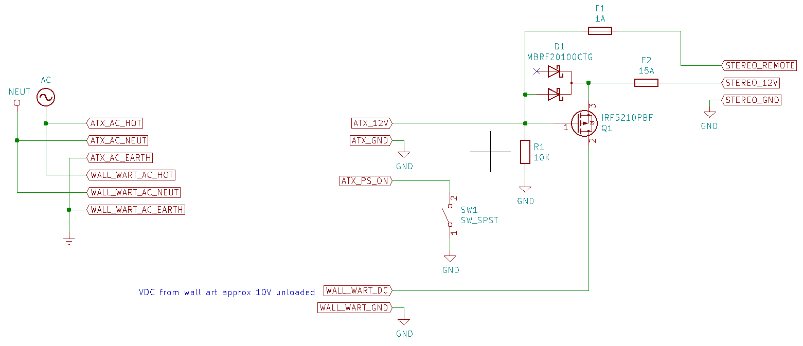
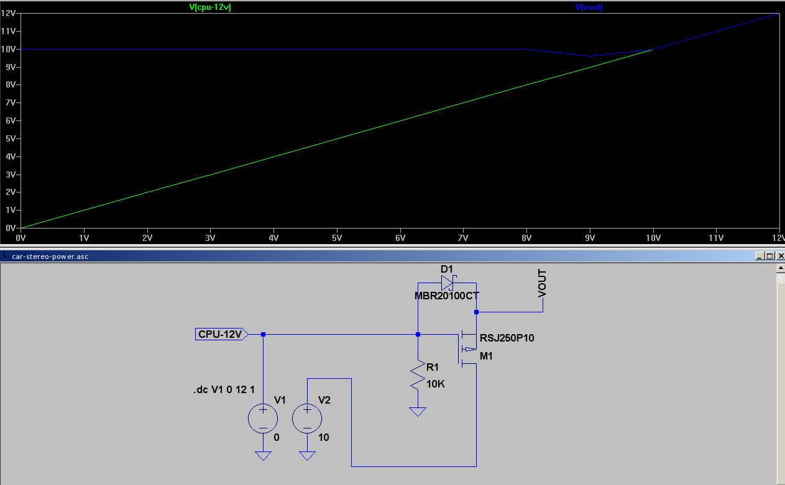

# ATX power supply powered car stereo
An ATX power supply powered car stereo project. Made using recycled electronics with the addition of a few inexpensive components.

## Why?
I've had this old Alpine head unit laying around for years, and I wanted to some music for my workshop. The design I came up with reuses existing electronics most hobbyists probably already have laying around.

## Build
So the basic building blocks are as follows
- Car stereo head unit
- ATX power supply >250W
- DC Wall wart 6V (it needs to output around 8-10V unloaded)
- A few electronic components (listed below)
- A box to put it all in (up to you)

## Design
So the design is quite simple, we use two power supplies. The ATX power supply does all the heavy lifting and powers the stereo when it's powered on. The wall wart is used to provide a constant power source and act like a battery in the car. You need this so the stereo doesn't lose all its settings everytime you power it off.

So the wall wart and ATX power supply are both connected to 120V all the time, and a switch is used to turn on the ATX power supply. When the power supply is turned a small electronic circuit is used to allow current to flow from the ATX power supply while stopping current from flowing from the wall wart.

The Power Supply Schematic is shown here: 

The Power Supply Simulation is shown here: 

When the switch is turned on, the ATX power supply voltage ramps up from 0 to 12V. This voltage is used to switch a mosfet and prevent current from flowing from the wall wart. A diode is used to prevent current from flowing the wrong direction from the wall wart to the ATX power supply.

## Parts
All parts are avaible from digikey or mouser

- Qty 1, ‎IRF5210PBF‎ P-Channel mosfet
- Qty 1, ‎MBRF20100CTG‎ Schottky diode
- Qty 1, 10K Resistor
- Qty 1, SPST switch M2011S3A1W03 or equivilent
- Qty 1, Fuse holder BK/HHL or similar
- Qty 1, 0297015.L 15A fuse or similar
- Qty 1, 0287001.PXCN 1A fuse or similar
- Qty 1, SBBTH1508-1 perfboard or similar
- Wire, and solder

## Assembly
Follow the schematic to wire up your power supply and to the stereo and ATX. For the stereo you'll have to do some digging or experimenting to figure out which wires are your 12V in, remote in, and speaker wires. Search online for a manual - you might get lucky.

## Notes
The fuses are obviously optional but are a good idea. I chose to add some speaker terminals I bought at a salvage yard along with some RC jacks for the aux input.
